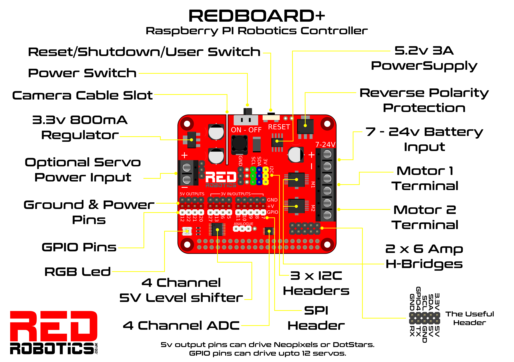

# PiWars 2024 Project
This project is designed for the PiWars 2024 competition.

# Installation Guide

## Prerequisites

Before you begin, ensure you have met the following requirements:

* You have installed the latest version of Python and pip. If not, you can download them from [here](https://www.python.org/downloads/).

* You have a Windows/Linux/Mac machine.
* You have a desktop environment installed and a display connected.
* You have a working camera connected.

## Installing Pi Wars

To install Pi Wars, follow these steps:

1. Clone the repository:
    ```
    git clone https://github.com/arozx/piwars2024.git
    ```

2. Navigate to the project directory:
    ```
    cd piwars2024
    ```

3. Install the requirements using pip:
    ```
    pip install -r requirements.txt
    ```

## Using Pi Wars Code

To use Pi Wars, follow these steps:


